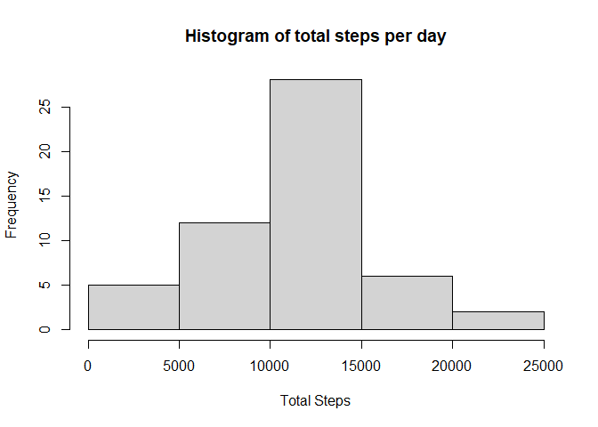
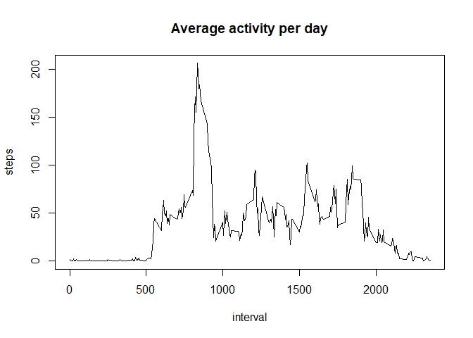
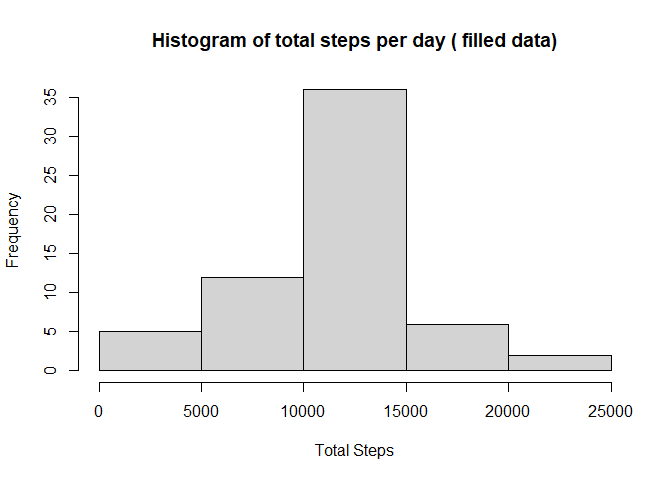
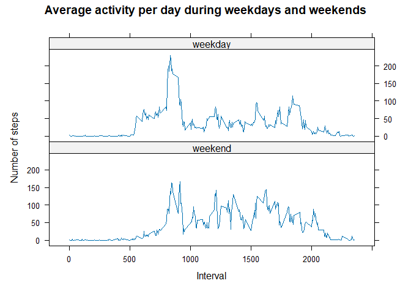

## Loading and preprocessing the data
First, we download our data.

``` r
if(! file.exists("data.zip")){
  download.file("https://d396qusza40orc.cloudfront.net/repdata%2Fdata%2Factivity.zip",
                destfile ="data.zip")
  zipped.file <- "data.zip"
  unzip(zipfile = "data.zip")
}
```

  
We use the *read.csv()* function to read our data, the we take a look at it using the *str()* function.


``` r
data <- read.csv("activity.csv", na.strings = "NA")
str(data)
```

```
## 'data.frame':	17568 obs. of  3 variables:
##  $ steps   : int  NA NA NA NA NA NA NA NA NA NA ...
##  $ date    : chr  "2012-10-01" "2012-10-01" "2012-10-01" "2012-10-01" ...
##  $ interval: int  0 5 10 15 20 25 30 35 40 45 ...
```
  
We see that our dates are in a character format. It is useful to transform them into a date format.

``` r
data$date <- as.Date(data$date, format = "%Y-%m-%d")
```

## What is mean total number of steps taken per day?
First we calculate the total number of steps taken per each day and create a histogram

``` r
total_steps <- aggregate( steps~date, data, sum)
hist(total_steps$steps, main= "Histogram of total steps per day", xlab="Total Steps")
```

<!-- -->

``` r
summary(total_steps$steps)
```

```
##    Min. 1st Qu.  Median    Mean 3rd Qu.    Max. 
##      41    8841   10765   10766   13294   21194
```

We see that the mean of steps taken per day is *10766* and the median is *10765*.  

  
## What is the average daily activity pattern?
First, we calculate the average steps in each interval during the day, then we create a time series plot.

``` r
average_activity <- aggregate(steps~interval, data, mean)
with(average_activity, plot(interval, steps,type="l", main="Average activity per day"))
```

<!-- -->

The time interval with the most activities is


``` r
average_activity$interval[which.max(average_activity$steps)]
```

```
## [1] 835
```

## Imputing missing values
Now we calculate the number of rows with NA values:

``` r
sum(is.na(data$steps))
```

```
## [1] 2304
```

We use the strategy to fill the missing values with the mean of steps per the 5-minute interval.

``` r
names(average_activity)<-c("interval", "average_steps")
data_filled <- merge(data,average_activity,by.x="interval", by.y="interval")
data_filled$steps[is.na(data_filled$steps)] <- data_filled$average_steps[is.na(data_filled$steps)]
data_filled$average_steps<-NULL
```
Now that we have our filled dataset, we aggregate the data again and create a new histogram with the total number of steps taken per each day.

``` r
total_steps_filled <- aggregate( steps~date, data_filled, sum)
hist(total_steps_filled$steps, main= "Histogram of total steps per day ( filled data)", xlab="Total Steps")
```

<!-- -->

``` r
summary(total_steps_filled$steps)
```

```
##    Min. 1st Qu.  Median    Mean 3rd Qu.    Max. 
##      41    9819   10766   10766   12811   21194
```
The mean of steps taken per day is *10766* and the median is *10766*. The result is almost the same as when we used the dataset with missing values.


## Are there differences in activity patterns between weekdays and weekends?

First, we use the *weekdays()* function to determine the days of the week. We create a new factor variable called *weekday* with values *TRUE* and *FALSE* based on the result of the *weekdays()* functions.


``` r
#create a vector of weekdays
weekdays1 <- c('Monday', 'Tuesday', 'Wednesday', 'Thursday', 'Friday')
data_filled$weekday <- factor((weekdays(data_filled$date) %in% weekdays1), 
         levels=c(FALSE, TRUE), labels=c('weekend', 'weekday')) 
```

Now we aggregate our data by the *interval* and the factor *weekday*.

``` r
average_activity_filled <- aggregate(steps~interval+weekday, data_filled, mean)
```

We create a panel plot of the 5-minute interval (x-axis) and the average number of steps taken, averaged across all weekday days or weekend days (y-axis).


``` r
library(lattice)
xyplot(steps ~ interval | weekday, data = average_activity_filled, type="l", layout = c(1, 2), xlab="Interval", ylab="Number of steps")
```

<!-- -->
